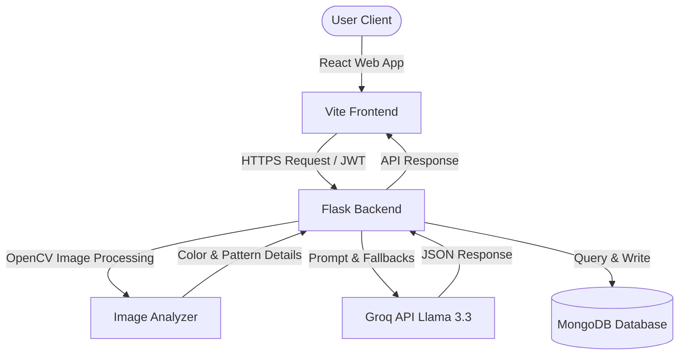

# StyleSense - AI Personal Stylist & Outfit Recommendation Platform

StyleSense is an intelligent, premium web application designed to act as a personal fashion stylist. It analyzes skin tones, identifies dominant colors and patterns in clothing items, allocates budgets across outfit components, and generates highly contextualized, coordinate-ready recommendations with shopping links for major Indian e-commerce marketplaces (Amazon, Myntra, Ajio, and Flipkart).

---

## 1. Project Description

StyleSense fills the gap between owning individual clothing items and composing cohesive, stylish outfits. The platform leverages advanced Computer Vision (OpenCV) and Large Language Models (LLM) to perform personal color analysis, analyze base items from user uploads, and distribute budget limits across recommended clothing parts. 

StyleSense is structured into two main recommendations engines:
1. **Get Whole Outfit Styled (Mode 1)**: Curates a complete outfit from scratch based on user gender, occasion, age, budget, and skin tone.
2. **Build Around My Item (Mode 2)**: Recommends complementary pieces (e.g., matching pants, shoes, watches) to pair with a base clothing item that the user already owns.
3. **Style Chat**: A natural, human-like chat interface for instant fashion, trends, color coordination, and styling advice.

---

## 2. Objectives

* **Personalized Color Theory**: Automate seasonal color analysis using computer vision to detect user skin tones and map them to harmonizing styling color palettes.
* **Budget-Aware Shopping**: Distribute a user's total outfit budget dynamically across selected clothing components (e.g. Top, Bottom, Footwear, Accessories) and construct direct e-commerce search queries under those specific budget thresholds.
* **Real-World Coordinate Pairings**: Enforce strict styling rules to avoid non-sensical clothing combinations, including specialized styling guidelines (such as ethnic wear blouses only being recommended with draped sarees or lehengas).
* **Premium User Experience**: Deliver a responsive, sleek dark-and-light-themed interface utilizing rich glassmorphism, balanced grid layouts, and visual progression states.
* **Human-Like Interactivity**: Format chatbot interactions without mechanical AI-looking markdown tags, presenting plain styled paragraphs and bullet lists as if chatting with a human stylist.

---

## 3. Features

* **Skin Tone Analysis**: Detects skin tone classifications (Fair, Light, Medium, Olive, Tan, Deep) via facial photo uploads or manual swatches, translating them to HEX values.
* **Color Palette Mapping**: Maps detected skin tones to custom collections of primary and secondary harmonizing styling colors.
* **K-Means Dominant Color Extraction**: Decodes base64 clothing uploads on the backend and runs K-Means color clustering to identify the primary color of an item.
* **Canny Edge Pattern Detection**: Evaluates clothing texture and edge density to classify patterns (e.g. solid, striped, patterned).
* **Smart Budget Allocation**: Distributes total budget across requested styling categories using pre-allocated weight factors based on gender.
* **Interactive Style Chat**: A conversational assistant that rejects off-topic queries and provides contextualized fashion guidance.
* **Personalized Lookbook**: Allows users to save favorite outfits, view estimated costs, and access direct purchase links.
* **Session History**: Records past styling recommendations for personalization.

---

## 4. System Architecture

StyleSense utilizes a client-server architecture with three main tiers:
1. **Frontend (React)**: Handles webcam capture, image uploads, profile preferences, dynamic grids, and chat history.
2. **Backend (Flask)**: Processes images via OpenCV, handles user authentication, computes budget shares, and coordinates AI prompting.
3. **Database (MongoDB)**: Stores persistent user profiles, past preference history, and saved styling recommendations.



---

## 5. Technology Stack

* **Frontend**:
  - React 18+ (Vite)
  - Vanilla CSS (Glassmorphism & HSL variables)
  - Lucide React (Icons)
  - React Webcam (Image capture)
* **Backend**:
  - Python 3.10+
  - Flask (REST API)
  - PyMongo (Database driver)
  - BCrypt & PyJWT (Auth & Security)
  - OpenCV (Computer Vision color & pattern extraction)
* **AI Engine**:
  - Groq API (Llama-3.3-70b-versatile, with fallbacks to Llama-3.1-8b-instant and Qwen-32b)
* **Database**:
  - MongoDB (NoSQL)

---

## 6. Workflow

### Mode 1: Get Whole Outfit Styled
1. **Step 1 (Upload)**: User uploads a face photo. OpenCV clusters skin pixels, detects the skin tone, and maps it to a color palette.
2. **Step 2 (Preferences)**: User selects Gender, Occasion, Age, and Total Budget. A Style Inspiration panel is shown on the right.
3. **Step 3 (Results)**: Backend query prompts Groq LLM using the skin tone color palette. Frontend displays 3 outfit options in a full-width grid.

### Mode 2: Build Around My Item
1. **Step 1 (Upload)**: User uploads a photo of their clothing item (or enters description manually).
2. **Step 2 (Preferences)**: User selects matching clothing categories (e.g. Pants, Shoes, Watch), enters total budget, and selects/detects skin tone via a modal prompt. Style Inspiration mood board displays on the right.
3. **Step 3 (Results)**: Backend OpenCV extracts the base item color/pattern, allocates budgets, prompts Groq, and returns 3 coordinated matching looks in a full-width grid.

---

## 7. Module Descriptions

### Backend Modules
* **`app.py`**: App initialization, CORS management, and blueprinted route registrations.
* **`db.py`**: Establishes MongoClient connections and provides collections references.
* **`routes/auth.py`**: User signup, login, profile queries, and token decoders.
* **`routes/outfit.py`**: Recommendation generator mapping requests to OpenCV analyzers and Groq completions.
* **`utils/image_analyzer.py`**: Decodes base64 images, runs KMeans clustering for dominant colors, scans texture edges using Canny filters, and allocates budget arrays based on gender.
* **`utils/groq_ai.py`**: Prompt formatting, fallback completion models, shopping link encoders, and chat response builders.

### Frontend Modules
* **`src/pages/StylingPage.jsx`**: Manages styling steps, modal dialogs, and recommendation generation.
* **`src/pages/ChatPage.jsx`**: Chat container with history filters and suggestions chips.
* **`src/components/dashboard/MarkdownText.jsx`**: Parses lists, headings, and paragraphs, stripping double-asterisks (`**`) and single-asterisks (`*`) to show clean plain text.
* **`src/components/outfit/OutfitCard.jsx`**: Renders outfit cards, estimated costs, and shopping logos.
* **`src/components/outfit/PhotoUploader.jsx`**: Handles drag-and-drop file uploads and webcam capture streams.

---

## 8. Database Design

### Collection: `users`
```json
{
  "_id": "ObjectId",
  "email": "user@example.com",
  "password": "hashed_bcrypt_password_bytes",
  "name": "User Name",
  "profile": {
    "gender": "Male | Female | Non-binary",
    "occasion": "Casual | College | Office",
    "age": 25,
    "budget": 2000,
    "skin_tone": "Medium",
    "skin_hex": "#DEB088"
  },
  "saved_outfits": [
    {
      "name": "Outfit Name",
      "budget_tier": "Balanced",
      "estimated_cost": 1800,
      "why_it_works": "Styling rationale...",
      "top": { "item": "Shirt", "color": "Navy", "estimated_cost": 800 },
      "bottom": { "item": "Chinos", "color": "Beige", "estimated_cost": 1000 },
      "saved_at": "ISODateString"
    }
  ],
  "past_preferences": ["Formal Male", "Casual Male"],
  "created_at": "ISODateString"
}
```

### Collection: `recommendations`
```json
{
  "_id": "ObjectId",
  "user_id": "user_objectId_string",
  "skin_tone": "Medium",
  "skin_hex": "#DEB088",
  "preferences": {
    "gender": "Male",
    "occasion": "Casual",
    "budget": 2000
  },
  "outfits": [],
  "color_palette": {
    "primary": ["#000080", "#EAE6DF"],
    "color_names": { "#000080": "Navy Blue" }
  },
  "overall_advice": "Style advice string...",
  "created_at": "ISODateString"
}
```

---

## 9. API Endpoints

| Endpoint | Method | Authentication | Request Payload | Response Data |
|---|---|---|---|---|
| `/auth/signup` | POST | None | `{email, password, name}` | `{user: {email, name, profile}}` |
| `/auth/login` | POST | None | `{email, password}` | `{token, user: {email, name, profile}}` |
| `/auth/profile` | GET | JWT Required | None | `{profile: {gender, occasion, age, budget}}` |
| `/auth/profile` | PUT | JWT Required | `{gender, occasion, age, budget}` | `{message: "Profile updated"}` |
| `/outfit/generate` | POST | JWT Required | `{mode, gender, occasion, age, budget, skin_tone, skin_hex, selected_categories, base_item_name, base_item_image}` | `{session_id, outfits: [], color_palette, overall_advice}` |
| `/outfit/save` | POST | JWT Required | `{outfit: {...}}` | `{message: "Outfit saved successfully"}` |
| `/outfit/saved` | GET | JWT Required | None | `{saved_outfits: []}` |
| `/outfit/saved/<outfit_name>` | DELETE | JWT Required | None | `{message: "Outfit removed"}` |
| `/chat/message` | POST | JWT Required | `{message, history: []}` | `{response: "Stylist reply text"}` |
| `/chat/history` | GET | JWT Required | Query param: `?search=keyword` | `{history: [{role, message}]}` |

---

## 10. UI Layout & User Experience

* **Landing Page**: Features a premium parallax hero header, statistics summary, structural timeline flow of how the engines run, and responsive action links.
* **Dashboard Page**: Displays lookbook favorites count, saved budget guidelines, recent styling session cards, and shortcut triggers.
* **Get Styled Page**: Structured around a 3-step progress bar:
  - Step 1: Upload uploader panels.
  - Step 2: Preferences panels on the left, with the `/styling_mood_board.png` image card on the right.
  - Step 3: Full-width responsive 3-column outfit grid with marketplace logos for Myntra, Ajio, Amazon, and Flipkart.
* **Style Chat Page**: A messenger panel containing suggestions chips and natural paragraph text bubbles with no asterisks.

---

## 11. Testing

### Automated Checks
* **Backend Verification**: Validate Python script syntaxes and blueprints compilation:
  ```bash
  python -m py_compile routes/outfit.py utils/image_analyzer.py utils/groq_ai.py
  ```
* **Frontend Compilation**: Verify JavaScript JSX syntax and React asset bundler generation:
  ```bash
  npm run build
  ```

### Manual Verification
* **Skin Tone Modal**: Trigger "Generate Recommendations" in build-around mode, switch between Manual selection swatches and Webcam detection, and verify skin tone variables propagate to recommendations.
* **Formatting Check**: Verify that chatbot replies contain no visible markdown `**` characters.
* **Layout Check**: Verify that Step 3 is full-width (cards stretch to fill the page) and Step 2 is balanced with a `1.25fr 1fr` split.

---

## 12. Future Enhancements

* **Virtual Try-On**: Integrate generative AI models (such as Stable Diffusion) to overlay recommended clothing items onto user photo templates.
* **Wardrobe Analytics**: Provide color distribution analytics of the user's uploaded wardrobe items.
* **Collaborative Feed**: Allow users to share styling coordinate selections publicly in a styling community feed.

---

## 13. Conclusion

StyleSense delivers a state-of-the-art styling companion combining standard computer vision with modern Large Language Models. Its budget allocation rules, Indian marketplace search query formatting, human-like chat features, and layout ratios provide a premium, cohesive personal fashion stylist assistant.
